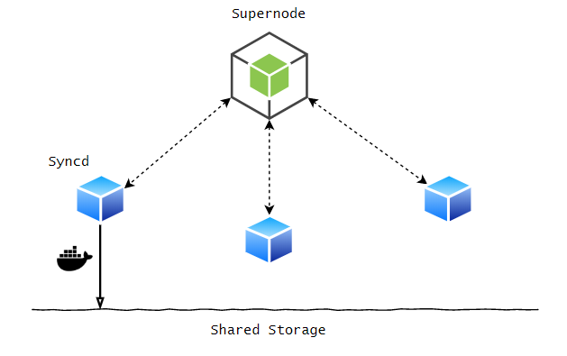

# Sync-util

## Introduction



Sync-util is a tool to manage and coordinate a cluster of nodes to properly handle the transferring of the image data of Docker to the shared storage. It is mainly designed to work with the [docker-extra](https://github.com/kubesys/docker-ext) project which uses the shared storage to speed up the creation of containers.

Sync-util consists of two components:

1. Supernode: Supernode manages the register and status of the image transfer tasks, it also provides a central lock service for all the Syncd process.
2. Syncd: Syncd monitors the updates of the docker images in local host and copies the new data to shared storage. It also reports the real-time status of running tasks to supernode.


## Usage

Start the supernode container on one node:
```
docker run -d --rm -p 12345:12345 lwyan/supernode:latest
```

Start the syncd container on each node:
```
docker run -d --rm -v {shared-storage-dir}:/sync-dir -v /var/lib/docker:/var/lib/docker -v /var/run/docker.sock:/var/run/docker.sock lwyan/syncd:latest /syncd --node-ip {supernode-ip} --node-port 12345 --sync-dir /sync-dir
```